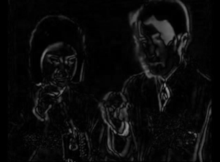
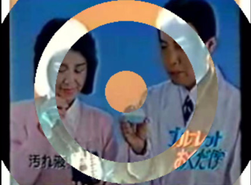

# FreeFrame 1 Effects for Resolume 2.41

After several years of not playing any/much VJ-gigs I recently re-started and went with [Resolume 2.41](https://resolume.com/download/file?file=resolume-2-41-installer.exe), which I very much loved back in the days. I tried to find all the effects I used but started to miss some, so I built these [FreeFrame 1.0](https://freeframe.sourceforge.net/) effects for Resolume 2.41 together with [Claude](https://claude.ai). Cross-compiled to 32-bit Windows DLLs from Linux using MinGW.

**Install:** drop the `.dll` into your Resolume FreeFrame folder: `C:\Programs (x86)\Resolume2.41\Addons`

**TODO:** 
* more effects
* link build instructions that exist inside each plugin-folder/README.md
* howto convert Resolume 2.41 recordings to mp4 
ffmpeg -i 2026-04-06-20-33-08.avi -c:a copy -c:v vp9 -b:v 100K 002-colorreduce.mp4 

---

## 001 — FrameDiff

Subtracts a delayed copy of the frame from the current frame, then doubles the difference and clamps it. Motion lights up; still areas go dark.

| Parameter | Range |
|-----------|-------|
| FrameDelay | 1–30 frames |

[Download FrameDiff.dll](public/FrameDiff.dll)

---

## 002 — ColorReduce

Finds the N most dominant colours in the frame and remaps every pixel to its nearest one — a posterisation that stays true to the actual palette of the image.

| Parameter | Range |
|-----------|-------|
| Colors | 2–64 |

[Download ColorReduce.dll](public/ColorReduce.dll)

---

## 003 — Rings

Draws concentric rings centred in the frame. Pixels that fall inside a ring are colour-inverted; pixels in the gaps between rings are left untouched.

| Parameter | Range |
|-----------|-------|
| NumRings | 1–50 |
| RingWidth | 1–255 px |
| GapWidth | 1–255 px |

[Download Rings.dll](public/Rings.dll)

---

*FreeFrame 1.0 — built with MinGW i686 on Linux — tested in Resolume 2.41 on Windows 11 — made with Claude*